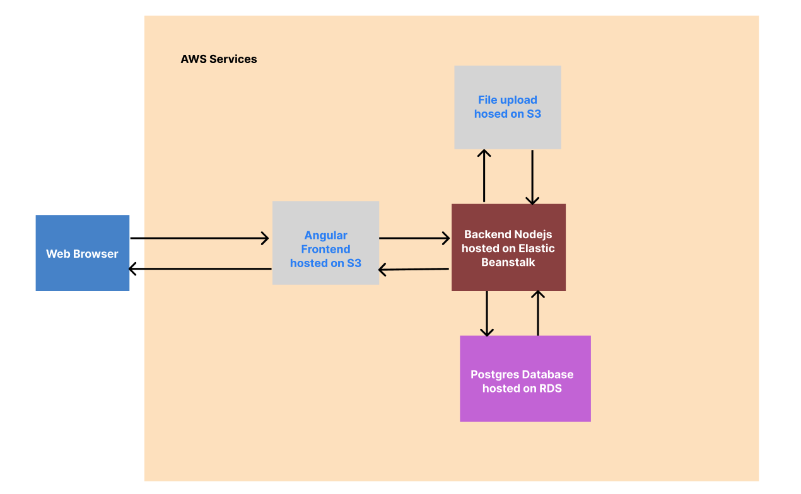

# Infrastructure

## AWS Services

- RDS
  Use for Postgres DataBase
- S3
  Use for host front-end application
  Use for storage file upload
- Elastic Beanstalk
  Use for host back-end application

## Schema

