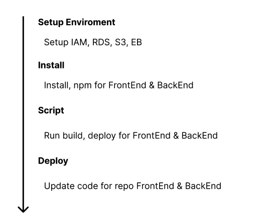

# Pipeline Process

## Step

1. Connect repository from Github connect to CircleCI

- Create Project
- Connect repo with CircleCI
- Configure variable environment
- Choose branh deploy

2. Setup AWS Enviroment(IAM, RDS, S3, EB)

- Create user on IAM
- Create database on RDS
- Create bucket on S3
- Create environment on Elastic Beanstalk

3. Configure script (install, build, deploy)

- Configure file .circlesci/config.yml
- Write script front-end install/build/deploy
- Write script back-end install/build/deploy

4. Push code to repository

- Update source code
- Commit and push to branch you chose deploy

## Schema

